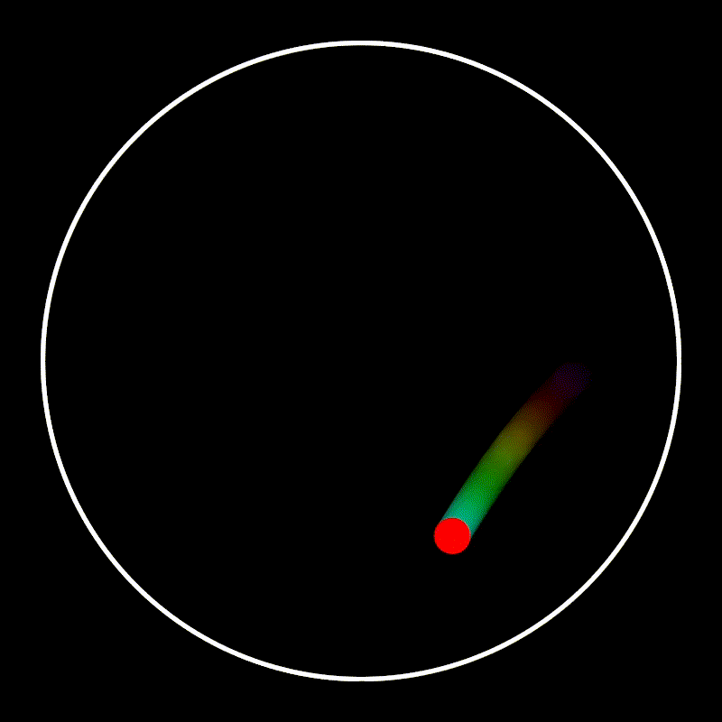

# Bouncing Ball Physics Simulation / Физическая симуляция падающего шарика



---

### Описание
Простая 2D физическая симуляция, написанная на C++ с использованием библиотеки **SFML**. Проект демонстрирует базовые принципы игровой физики (гравитация, упругое столкновение) и рендеринга с визуальными эффектами. Шарик падает в круглом контейнере, отскакивает от стенок и оставляет за собой красивый "гипнотический" радужный хвост.

Все параметры симуляции легко настраиваются через константы в коде, что позволяет экспериментировать с результатом.

### Description
A simple 2D physics simulation written in C++ using the **SFML** library. The project demonstrates basic principles of game physics (gravity, elastic collision) and rendering with visual effects. A ball falls inside a circular container, bounces off the walls, and leaves a beautiful "hypnotic" rainbow trail behind it.

All simulation parameters are easily configurable via constants in the code, allowing for easy experimentation with the final result.

---

###  Ключевые возможности / Features

*   **Физическая симуляция / Physics Simulation**: Гравитация и упругое отражение от стенок контейнера.
*   **Динамический рост / Dynamic Growth**: Опциональная возможность увеличения радиуса шарика при каждом ударе (`GROW_ON_HIT`).
*   **Радужный хвост / Rainbow Trail**: Плавный, затухающий след, цвет которого переливается по спектру (HSV → RGB).
*   **Качественный рендеринг / High-Quality Rendering**: Используется сглаживание MSAA для четких и гладких контуров.
*   **Полная настраиваемость / Fully Configurable**: Абсолютно все параметры (скорость, гравитация, цвета, длина хвоста) вынесены в `constexpr` переменные в `src/main.cpp` для быстрой настройки.

---

### Настройка

Все параметры симуляции находятся в верхней части файла `src/main.cpp`. Вы можете легко изменить их и пересобрать проект, чтобы увидеть результат.

Например, вы можете включить рост шарика, увеличить гравитацию или замедлить смену цветов хвоста:
```cpp
// src/main.cpp

// ...
// [RU] Рост шарика при столкновении
// [EN] Ball growth on collision
constexpr bool  GROW_ON_HIT  = true;  // [RU] меняем на true
                                      // [EN] change to true

constexpr float GROW_PER_HIT = 1.0f;  // [RU] растем медленнее
                                      // [EN] grow slower

// ...
constexpr float GRAVITY      = 1200.0f; // [RU] сильнее гравитация
                                        // [EN] stronger gravity

// ...
constexpr float HUE_SPEED    = 30.f;  // [RU] радуга медленнее
                                      // [EN] slower rainbow
// ...
```

###  Configuration

All simulation parameters are located at the top of the `src/main.cpp` file. You can easily modify them and rebuild the project to see the result.

For example, you can enable ball growth, increase gravity, or slow down the trail's color transition:
```cpp
// src/main.cpp

// ...
// Ball growth on collision
constexpr bool  GROW_ON_HIT  = true;  // change to true

constexpr float GROW_PER_HIT = 1.0f;  // grow slower

// ...
constexpr float GRAVITY      = 1200.0f; // stronger gravity

// ...
constexpr float HUE_SPEED    = 30.f;  // slower rainbow
// ...
```

---

###  Сборка и запуск / Build & Run

#### Зависимости / Dependencies
*   C++17 compiler (MSVC, GCC, Clang)
*   [CMake](https://cmake.org/download/) (версия/version 3.21+)
*   [SFML 3.0+](https://www.sfml-dev.org/download.php)
    *   *Рекомендуемый способ установки SFML — через менеджер пакетов [vcpkg](https://vcpkg.io/en/index.html).*

#### Шаги сборки / Build Steps

1.  **Клонируйте репозиторий:**
    ```bash
    git clone https://github.com/horsebets53/bouncing-ball.git
    cd bouncing-ball
    ```

2.  **Сконфигурируйте проект с помощью CMake:**
    *   (Если вы используете **vcpkg**, не забудьте указать toolchain-файл)
    ```bash
    # Создаем папку для сборки и запускаем CMake
    cmake -B build -S . -DCMAKE_TOOLCHAIN_FILE=C:/vcpkg/scripts/buildsystems/vcpkg.cmake
    ```
    *   (Если SFML установлен глобально, команда проще):
    ```bash
    cmake -B build -S .
    ```

3.  **Соберите проект:**
    ```bash
    cmake --build build
    ```

4.  **Запустите приложение:**
    *   На Windows: `build\Debug\ball.exe`
    *   На Linux/macOS: `build/ball`


###  Build & Run

#### Dependencies
*   A C++17 compliant compiler (MSVC, GCC, Clang)
*   [CMake](https://cmake.org/download/) (version 3.21+)
*   [SFML 3.0+](https://www.sfml-dev.org/download.php)
    *   *The recommended way to install SFML is through a package manager like [vcpkg](https://vcpkg.io/en/index.html).*

#### Build Steps

1.  **Clone the repository:**
    ```bash
    git clone https://github.com/horsebets53/bouncing-ball.git
    cd bouncing-ball
    ```

2.  **Configure the project using CMake:**
    *   (If you are using **vcpkg**, don't forget to specify the toolchain file)
    ```bash
    # Create a build directory and run CMake
    cmake -B build -S . -DCMAKE_TOOLCHAIN_FILE=C:/vcpkg/scripts/buildsystems/vcpkg.cmake
    ```
    *   (If SFML is installed globally, the command is simpler):
    ```bash
    cmake -B build -S .
    ```

3.  **Build the project:**
    ```bash
    cmake --build build
    ```

4.  **Run the application:**
    *   On Windows: `build\Debug\ball.exe`
    *   On Linux/macOS: `build/ball`


---

###  Лицензия / License

Этот проект распространяется под лицензией MIT. Подробности смотрите в файле `LICENSE.md`.

This project is licensed under the MIT License - see the `LICENSE.md` file for details.
